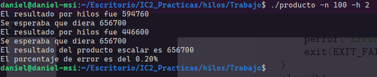
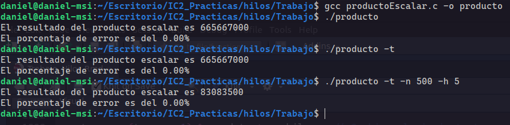

```{r setup, include=FALSE}
knitr::opts_chunk$set(echo = TRUE)
```

\newpage


# Introducción

En el desarrollo de este trabajo vamoa atratar de realizar el producto escalar de dos vectores usando hilos para ello vamos a empezar explicando un poco los hilos y realizando algunos ejercicios de prueba.

## Hilos en C

Si queremos que nuestro programa empiece a ejecutar varias cosas "a la vez", tenemos dos opciones. Por una parte podemos crear un nuevo proceso y por otra, podemos crear un nuevo hilo de ejecución (un thread). En realidad nuestro ordenador, salvo que tenga varias cpu, no ejecutará varias cosas a la vez. Cuando digo "a la vez", me refiero a que el sistema operativo irá ejecutando cachos de programa por turnos (por rodajas de tiempo) de forma muy rápida, dando la sensación de simultaneidad.

## Diferencia entre procesos e hilos

Un proceso de unix es cualquier programa en ejecución y es totalmente independiente de otros procesos. El comando de unix ps nos lista los procesos en ejecución en nuestra máquina. Un proceso tiene su propia zona de memoria y se ejecuta "simultáneamente" a otros procesos. Es totalemente imposible en unix que un proceso se meta, a posta o por equivocación, en la zona de memoria de otro proceso. Esta es una de las caracteristicas que hace de unix un sistema fiable. Un programa chapucero o malintencionado no puede fastidiar otros programas en ejecución ni mucho menos a los del sistema operativo. Si el programa chapucero se cae, se cae sólo él.

Dentro de un proceso puede haber varios hilos de ejecución (varios threads). Eso quiere decir que un proceso podría estar haciendo varias cosas "a la vez". Los hilos dentro de un proceso comparten todos la misma memoria. Eso quiere decir que si un hilo toca una variable, todos los demás hilos del mismo proceso verán el nuevo valor de la variable. Esto hace imprescindible el uso de semáforos o mutex, para evitar que dos threads accedan a la vez a la misma estructura de datos. También hace que si un hilo "se equivoca" y corrompe una zona de memoria, todos los demás hilos del mismo proceso vean la memoria corrompida. Un fallo en un hilo puede hacer fallar a todos los demás hilos del mismo proceso.

Un proceso es, por tanto,  más costoso de lanzar, ya que se necesita crear una copia de toda la memoria de nuestro programa. Los hilos son más ligeros.


# Hello world con hilos

Primero vamos a realizar el ejercicio sin usar hilos

```{c, eval=FALSE}
# include <stdio.h>

void mensaje() {
    printf("==Hola Mundo==\n");
}

int main(int argc, char const *argv[])
{
    mensaje();
    return 0;
}
```

Este programa imprime un sencillo hola mundo por pantalla. Ahora vamos a implementar los hilos, para ello tenemos que incluir la librería pthreads.

```{c, eval=FALSE}
# include <stdio.h>
# include <pthread.h>

void *mensaje() {
    printf("==Hola Mundo==\n");
}

int main(int argc, char const *argv[])
{
    pthread_t thread;
    //mensaje();
    pthread_create(&thread, NULL, mensaje, NULL);
    return 0;
}
```

Se crea el programa sencillo de hola mundo y se compila y se ejecuta de la siguiente manera

- Compilación

```{bash, eval=FALSE}
gcc helloWorld.c -o hola -lpthread
```

- Ejecución

{width=100%}

Como vemos no se ha ejecutado nada ya que lo que ha pasado aqui es que no hemos esperado a que terminase el hilo y el proceso principal ha terminado y ha cerrado el programa. Ya que en los hilos si termina el proceso principal automáticamente termina todos los hilos.

Para solucionar eso modificaremos el programa de la siguiente manera

```{c, eval=FALSE}
# include <stdio.h>
# include <pthread.h>

void *mensaje() {
    printf("==Hola Mundo==\n");
}

int main(int argc, char const *argv[])
{
    pthread_t thread;
    //mensaje();
    pthread_create(&thread, NULL, mensaje, NULL);
    pthread_join(thread, NULL);
    return 0;
}
```

- Compilación

```{bash, eval=FALSE}
gcc helloWorld.c -o hola -lpthread
```

- Ejecución

{width=100%}

Ahora si se ejecuta correctamente el programa


## Creación de 2 hilos

Para crear otro hilo que ejecute la misma función tenemos que crear otro identifiador, realizar el create y esperar tambien por ese hilos.

```{c, eval=FALSE}
# include <stdio.h>
# include <pthread.h>

void *mensaje() {
    printf("==Hola Mundo==\n");
}

int main(int argc, char const *argv[])
{
    pthread_t thread1, thread2;
    //mensaje();
    pthread_create(&thread1, NULL, mensaje, NULL);
    pthread_create(&thread2, NULL, mensaje, NULL);
    pthread_join(thread1, NULL);
    pthread_join(thread2, NULL);
    return 0;
}
```


- Ejecución


{width=100%}

Como vemos ejecuta correctamente los dos hilos imprimiendo "==Hola Mundo=="

# Producto Escalar

El código del producto escalar sería el siguiente

```{c, eval=FALSE}
#include <stdio.h>
#include <stdlib.h>
#include <pthread.h>

#define TAMAÑO_VECTOR 1000 // Tamaño de los vectores
#define NUM_HILOS 4 // Número de hilos

// Estructura para los argumentos del hilo
struct thread_data {
    int thread_id;
    int *vector1;
    int *vector2;
    int size;
    double *resultado;
};

// Función que ejecutará cada hilo
void *dot_product(void *threadarg) {
    struct thread_data *my_data;
    my_data = (struct thread_data *) threadarg;
    int start = my_data->thread_id * my_data->size / TAMAÑO_VECTOR;
    int end = (my_data->thread_id + 1) * my_data->size / NUM_HILOS;
    double *local_result = (double *)malloc(sizeof(double));
    *local_result = 0.0;

    for (int i = start; i < end; i++) {
        *local_result += (double) (my_data->vector1[i] * my_data->vector2[i]);
    }

    my_data->resultado[my_data->thread_id] = *local_result;
    pthread_exit(NULL);
}

int main() {
    int vector1[TAMAÑO_VECTOR];
    int vector2[TAMAÑO_VECTOR];
    double result[NUM_HILOS];
    pthread_t threads[NUM_HILOS];
    struct thread_data td[NUM_HILOS];

    // Inicialización de vectores
    for (int i = 0; i < TAMAÑO_VECTOR; i++) {
        vector1[i] = i;
        vector2[i] = i * 3;
    }

    // Creación de los hilos
    for (int i = 0; i < NUM_HILOS; i++) {
        td[i].thread_id = i;
        td[i].vector1 = vector1;
        td[i].vector2 = vector2;
        td[i].size = TAMAÑO_VECTOR;
        td[i].resultado = result;
        pthread_create(&threads[i], NULL, dot_product, (void *)&td[i]);
    }

    // Espera a que todos los hilos terminen
    for (int i = 0; i < NUM_HILOS; i++) {
        pthread_join(threads[i], NULL);
    }

    // Cálculo del producto escalar final
    double final_result = 0.0;
    for (int i = 0; i < NUM_HILOS; i++) {
        final_result += result[i];
    }

    printf("El producto escalar es: %f\n", final_result);

    pthread_exit(NULL);
}
```

- Ejecución

{width=100%}

En este código relizamos el producto escalar que tiene la siguiente formula.

$$\text{Siendo dos vectores }a, b\in R\hspace{2mm}a=(a_{0}, a_{1},...,a_{n-1})\hspace{2mm}b=(b_{0}, b_{1},...,b_{n-1})$$

$$a \cdot b=\sum_{0}^{n-1}a_{i} \cdot b_{i}$$

Este tipo de producto escalar lo realizamos con el código anterior. Ahora lo que tenemos es que hacer el producto escalar sin hilos y relizarlo multiple veces para ver que no hay ningún error.


```{c, eval=FALSE}
#include <stdio.h>
#include <stdlib.h>
#include <pthread.h>

#define TAMAÑO_VECTOR 63 // Tamaño de los vectores
#define NUM_HILOS 4 // Número de hilos

// Estructura para los argumentos del hilo
struct thread_data {
    int thread_id;
    int *vector1;
    int *vector2;
    int size;
    double *R;
    double local_result;
};

// Función que ejecutará cada hilo
void *dot_product(void *threadarg) {
    struct thread_data *my_data;
    my_data = (struct thread_data *) threadarg;
    int start = (my_data->thread_id * my_data->size) / NUM_HILOS;
    int end = (my_data->thread_id + 1) * my_data->size / NUM_HILOS;
    double local_result = 0.0;

//    printf("---------------------------\n");
//    printf("El hilo %d va a empezar a recorrer por %d y termina en %d\n", my_data->thread_id, start, end);

    for (int i = start; i < end; i++) {
        local_result += (double) (my_data->vector1[i] * my_data->vector2[i]);
    }
//    printf("El resultado local es %.2f\n", local_result);
//    printf("---------------------------\n");
    my_data->R[my_data->thread_id] = local_result;
    local_result = 0.0;
    pthread_exit(NULL);
}

int main() {
    double R;
    int contador;
    int vector1[TAMAÑO_VECTOR];
    int vector2[TAMAÑO_VECTOR];
    double result[NUM_HILOS];
    pthread_t threads[NUM_HILOS];
    struct thread_data td[NUM_HILOS];

    // Inicialización de vectores
    for (int i = 0; i < TAMAÑO_VECTOR; i++) {
        vector1[i] = i;
        vector2[i] = i * 2;
    }
    for (int i = 0; i < 1000; i++)
    {
        // Creación de los hilos
        for (int j = 0; j < NUM_HILOS; j++) {
            td[j].thread_id = j;
            td[j].vector1 = vector1;
            td[j].vector2 = vector2;
            td[j].size = TAMAÑO_VECTOR;
            td[j].R = result;
            pthread_create(&threads[j], NULL, dot_product, (void *)&td[j]);
        }

        // Espera a que todos los hilos terminen
        for (int i = 0; i < NUM_HILOS; i++) {
            pthread_join(threads[i], NULL);
        }

        // Cálculo del producto escalar final
        R = 0.0; // Usamos double para mayor precisión en el cálculo
        for (int i = 0; i < NUM_HILOS; i++) {
            R += result[i];
        }

        // Verificación del producto escalar
        double expected_result = 0.0;
        for (int i = 0; i < TAMAÑO_VECTOR; i++) {
            expected_result += (double)(vector1[i] * vector2[i]);
        }

        if (R != expected_result) {
            printf("El resultado por hilos fue %.2f\n", R);
            printf("Se esperaba que diese %.2f", expected_result);
            contador++;
        }
    }
    printf("El contador es %d\n", contador);
    double procetaje = contador / 1000;
    printf("El resultado del producto escalar es %.2f\n", R);
    printf("El porcentaje de error es del %f\n", procetaje);
}
```

Con este código ya podemos comprobar si el resultado es correcto o hay algun error en alguna ejecución

- Ejecución

{width=100%}

Ahora vamos a implementar el apartado de los archivos

## Usando archivos

Para este apartado simplemente guardaremos el resultado en un fichero de texto  llamado `resultado.txt``

- Código

```{c, eval=FALSE}
#include <stdio.h>
#include <stdlib.h>
#include <pthread.h>
#include <sys/types.h>
#include <sys/stat.h>
#include <fcntl.h>
#include <unistd.h>

#define TAMAÑO_VECTOR 1000 // Tamaño de los vectores
#define NUM_HILOS 4 // Número de hilos

// Estructura para los argumentos del hilo
struct thread_data {
    int thread_id;
    int *vector1;
    int *vector2;
    int size;
    double *R;
    double local_result;
};

// Función que ejecutará cada hilo
void *dot_product(void *threadarg) {
    struct thread_data *my_data;
    my_data = (struct thread_data *) threadarg;
    int start = (my_data->thread_id * my_data->size) / NUM_HILOS;
    int end = (my_data->thread_id + 1) * my_data->size / NUM_HILOS;
    double local_result = 0.0;

//    printf("---------------------------\n");
//    printf("El hilo %d va a empezar a recorrer por %d y termina en %d\n", my_data->thread_id, start, end);

    for (int i = start; i < end; i++) {
        local_result += (double) (my_data->vector1[i] * my_data->vector2[i]);
    }
//    printf("El resultado local es %.2f\n", local_result);
//    printf("---------------------------\n");
    my_data->R[my_data->thread_id] = local_result;
    local_result = 0.0;
    pthread_exit(NULL);
}

int main() {
    double R;
    int contador = 0;
    int vector1[TAMAÑO_VECTOR];
    int vector2[TAMAÑO_VECTOR];
    double result[NUM_HILOS];
    pthread_t threads[NUM_HILOS];
    struct thread_data td[NUM_HILOS];
    char cadena_decimal[100];

    // Inicialización de vectores
    for (int i = 0; i < TAMAÑO_VECTOR; i++) {
        vector1[i] = i;
        vector2[i] = i * 2;
    }
    for (int i = 0; i < 1000; i++)
    {
        // Creación de los hilos
        for (int j = 0; j < NUM_HILOS; j++) {
            td[j].thread_id = j;
            td[j].vector1 = vector1;
            td[j].vector2 = vector2;
            td[j].size = TAMAÑO_VECTOR;
            td[j].R = result;
            pthread_create(&threads[j], NULL, dot_product, (void *)&td[j]);
        }

        // Espera a que todos los hilos terminen
        for (int i = 0; i < NUM_HILOS; i++) {
            pthread_join(threads[i], NULL);
        }

        // Cálculo del producto escalar final
        R = 0.0; // Usamos double para mayor precisión en el cálculo
        for (int i = 0; i < NUM_HILOS; i++) {
            R += result[i];
        }

        // Verificación del producto escalar
        double expected_result = 0.0;
        for (int i = 0; i < TAMAÑO_VECTOR; i++) {
            expected_result += (double)(vector1[i] * vector2[i]);
        }

        if (R != expected_result) {
            printf("El resultado por hilos fue %.2f\n", R);
            printf("Se esperaba que diese %.2f", expected_result);
            contador++;
        }
    }

    // Convertir el resultado a string
    int chars_escribir = snprintf(cadena_decimal, sizeof(cadena_decimal), "%.2f", R);
    if (chars_escribir < 0) {
        perror("Error al convertir el resultado a cadena");
        exit(EXIT_FAILURE);
    }

    // Guardar el resultado en un fichero txt
    int h;
    h = open("resultado.txt", O_RDWR | O_CREAT | O_TRUNC, S_IRUSR | S_IWUSR);
    if (h == -1) {
        perror("Error al abrir el archivo");
        exit(EXIT_FAILURE);
    }
    if (write(h, cadena_decimal, chars_escribir) == -1) {
        perror("Error al escribir en el archivo");
        exit(EXIT_FAILURE);
    }
    close(h);

    double porcentaje_error = (double)contador / 10;
    printf("El resultado del producto escalar es %.2f\n", R);
    printf("El porcentaje de error es del %.2f%% \n", porcentaje_error);
}
```

Con este código podemos guardar el resultado en un fichero.txt

- Ejecución

{width=100%}

## Version 0.0.1

```{c, eval=FALSE}
#include <stdio.h>
#include <stdlib.h>
#include <pthread.h>
#include <sys/types.h>
#include <sys/stat.h>
#include <fcntl.h>
#include <unistd.h>

#define TAMAÑO_VECTOR 1000 // Tamaño de los vectores
#define NUM_HILOS 4 // Número de hilos

// Estructura para los argumentos del hilo
struct thread_data {
    int thread_id;
    int *vector1;
    int *vector2;
    int size;
    double *R;
    double local_result;
};

// Función que ejecutará cada hilo
void *dot_product(void *threadarg) {
    struct thread_data *my_data;
    my_data = (struct thread_data *) threadarg;
    int start = (my_data->thread_id * my_data->size) / NUM_HILOS;
    int end = (my_data->thread_id + 1) * my_data->size / NUM_HILOS;
    double local_result = 0.0;

//    printf("---------------------------\n");
//    printf("El hilo %d va a empezar a recorrer por %d y termina en %d\n", my_data->thread_id, start, end);

    for (int i = start; i < end; i++) {
        local_result += (double) (my_data->vector1[i] * my_data->vector2[i]);
    }
//    printf("El resultado local es %.2f\n", local_result);
//    printf("---------------------------\n");
    my_data->R[my_data->thread_id] = local_result;
    local_result = 0.0;
    pthread_exit(NULL);
}

int main() {
    double R;
    int contador = 0;
    int vector1[TAMAÑO_VECTOR];
    int vector2[TAMAÑO_VECTOR];
    double result[NUM_HILOS];
    pthread_t threads[NUM_HILOS];
    struct thread_data td[NUM_HILOS];
    char cadena_decimal[100];

    // Inicialización de vectores
    for (int i = 0; i < TAMAÑO_VECTOR; i++) {
        vector1[i] = i;
        vector2[i] = i * 2;
    }
    for (int i = 0; i < 1000; i++)
    {
        // Creación de los hilos
        for (int j = 0; j < NUM_HILOS; j++) {
            td[j].thread_id = j;
            td[j].vector1 = vector1;
            td[j].vector2 = vector2;
            td[j].size = TAMAÑO_VECTOR;
            td[j].R = result;
            pthread_create(&threads[j], NULL, dot_product, (void *)&td[j]);
        }

        // Espera a que todos los hilos terminen
        for (int i = 0; i < NUM_HILOS; i++) {
            pthread_join(threads[i], NULL);
        }

        // Cálculo del producto escalar final
        R = 0.0; // Usamos double para mayor precisión en el cálculo
        for (int i = 0; i < NUM_HILOS; i++) {
            R += result[i];
        }

        // Verificación del producto escalar
        double expected_result = 0.0;
        for (int i = 0; i < TAMAÑO_VECTOR; i++) {
            expected_result += (double)(vector1[i] * vector2[i]);
        }

        if (R != expected_result) {
            printf("El resultado por hilos fue %.2f\n", R);
            printf("Se esperaba que diese %.2f", expected_result);
            contador++;
        }
    }

    // Convertir el resultado a string
    int chars_escribir = snprintf(cadena_decimal, sizeof(cadena_decimal), "%.2f", R);
    if (chars_escribir < 0) {
        perror("Error al convertir el resultado a cadena");
        exit(EXIT_FAILURE);
    }

    // Guardar el resultado en un fichero txt
    int h;
    h = open("resultado.txt", O_RDWR | O_CREAT | O_TRUNC, S_IRUSR | S_IWUSR);
    if (h == -1) {
        perror("Error al abrir el archivo");
        exit(EXIT_FAILURE);
    }
    if (write(h, cadena_decimal, chars_escribir) == -1) {
        perror("Error al escribir en el archivo");
        exit(EXIT_FAILURE);
    }
    close(h);

    double porcentaje_error = (double)contador / 10;
    printf("El resultado del producto escalar es %.2f\n", R);
    printf("El porcentaje de error es del %.2f%% \n", porcentaje_error);
}
```

# Requisitos opcionales

## División equilibrada de los vectores entre los hilos

En el código tenemos una parte de la funcion que nos divide la parte del vector a la que se va a encargar de realizar el calculo cada hilo.

```{c, eval=FALSE}
void *dot_product(void *threadarg) {
    struct thread_data *my_data;
    my_data = (struct thread_data *) threadarg;
    int start = (my_data->thread_id * my_data->size) / NUM_HILOS;
    int end = (my_data->thread_id + 1) * my_data->size / NUM_HILOS;
    double local_result = 0.0;

//    printf("---------------------------\n");
//    printf("El hilo %d va a empezar a recorrer por %d y termina en %d\n", my_data->thread_id, start, end);

    for (int i = start; i < end; i++) {
        local_result += (double) (my_data->vector1[i] * my_data->vector2[i]);
    }
//    printf("El resultado local es %.2f\n", local_result);
//    printf("---------------------------\n");
    my_data->R[my_data->thread_id] = local_result;
    local_result = 0.0;
    pthread_exit(NULL);
}
```

Esta es la función que ejecuta cada hilo y vemos que calcula start y el end dependiendo del id del hilo. Por ejemplo:

Si tenemos ejecutando el hilo 1 de 4 que tenemos, y tenemos un vector de tamaño 1000 el calculo de start sera :

$$start=1*1000/4=250$$

Y el end será:

$$end=2*1000/4=500$$

Entonces como vemos se divide el tamaño del vector en funcion del el hilo que se este ejecutando.


## Opciones linea de comandos

- Código

```{c, eval=FALSE}
#include <stdio.h>
#include <stdlib.h>
#include <pthread.h>
#include <sys/types.h>
#include <sys/stat.h>
#include <fcntl.h>
#include <unistd.h>
#include <getopt.h> // Para el análisis de opciones de línea de comandos

#define TAMAÑO_MAX_VECTOR 1000 // Tamaño máximo del vector
#define NUM_HILOS_MAX 10 // Número máximo de hilos

// Estructura para los argumentos del hilo
struct thread_data {
    int thread_id;
    int *vector1;
    int *vector2;
    int size;
    double *R;
    int num_hilos;
};

// Función que ejecutará cada hilo
void *dot_product(void *threadarg) {
    struct thread_data *my_data;
    my_data = (struct thread_data *) threadarg;
    int start = (my_data->thread_id * my_data->size) / my_data->num_hilos;
    int end = (my_data->thread_id + 1) * my_data->size / my_data->num_hilos;
    double local_result = 0.0;

    for (int i = start; i < end; i++) {
        local_result += (double) (my_data->vector1[i] * my_data->vector2[i]);
    }
    my_data->R[my_data->thread_id] = local_result;
    local_result = 0.0;
    pthread_exit(NULL);
}

int main(int argc, char *argv[]) {
    int num_hilos = NUM_HILOS_MAX;
    int tamaño_vector = TAMAÑO_MAX_VECTOR;

    // Parseo de argumentos de línea de comandos
    int opt;
    while ((opt = getopt(argc, argv, "n:h:")) != -1) {
        switch (opt) {
            case 'n':
                tamaño_vector = atoi(optarg);
                break;
            case 'h':
                num_hilos = atoi(optarg);
                break;
            default:
                fprintf(stderr, "Uso: %s -n <tamaño_vector> -h <num_hilos>\n", argv[0]);
                exit(EXIT_FAILURE);
        }
    }

    // Verificación de los valores ingresados
    if (tamaño_vector <= 0 || tamaño_vector > TAMAÑO_MAX_VECTOR || 
        num_hilos <= 0 || num_hilos > NUM_HILOS_MAX) {
        fprintf(stderr, "Los valores de tamaño de vector y número de hilos 
                  deben estar entre 1 y %d\n", TAMAÑO_MAX_VECTOR);
        exit(EXIT_FAILURE);
    }

    double R;
    int contador = 0;
    int vector1[tamaño_vector];
    int vector2[tamaño_vector];
    double result[num_hilos];
    pthread_t threads[num_hilos];
    struct thread_data td[num_hilos];
    char cadena_decimal[100];

    // Inicialización de vectores
    for (int i = 0; i < tamaño_vector; i++) {
        vector1[i] = i;
        vector2[i] = i * 2;
    }
    for (int i = 0; i < 1000; i++)
    {
        // Creación de los hilos
        for (int j = 0; j < num_hilos; j++) {
            td[j].thread_id = j;
            td[j].vector1 = vector1;
            td[j].vector2 = vector2;
            td[j].size = tamaño_vector;
            td[j].R = result;
            td[j].num_hilos = num_hilos;
            pthread_create(&threads[j], NULL, dot_product, (void *)&td[j]);
        }

        // Espera a que todos los hilos terminen
        for (int i = 0; i < num_hilos; i++) {
            pthread_join(threads[i], NULL);
        }

        // Cálculo del producto escalar final
        R = 0.0; // Usamos double para mayor precisión en el cálculo
        for (int i = 0; i < num_hilos; i++) {
            R += result[i];
        }

        // Verificación del producto escalar
        double expected_result = 0.0;
        for (int i = 0; i < tamaño_vector; i++) {
            expected_result += (double)(vector1[i] * vector2[i]);
        }

        if (R != expected_result) {
            printf("El resultado por hilos fue %.2f\n", R);
            printf("Se esperaba que diera %.2f\n", expected_result);
            contador++;
        }
    }

    // Convertir el resultado a string
    int chars_escribir = snprintf(cadena_decimal, sizeof(cadena_decimal), "%.2f", R);
    if (chars_escribir < 0) {
        perror("Error al convertir el resultado a cadena");
        exit(EXIT_FAILURE);
    }

    // Guardar el resultado en un fichero txt
    int h;
    h = open("resultado.txt", O_RDWR | O_CREAT | O_TRUNC, S_IRUSR | S_IWUSR);
    if (h == -1) {
        perror("Error al abrir el archivo");
        exit(EXIT_FAILURE);
    }
    if (write(h, cadena_decimal, chars_escribir) == -1) {
        perror("Error al escribir en el archivo");
        exit(EXIT_FAILURE);
    }
    close(h);

    double porcentaje_error = (double)contador / 10;
    printf("El resultado del producto escalar es %.2f\n", R);
    printf("El porcentaje de error es del %.2f%% \n", porcentaje_error);
}
```


- Ejecución 


{width=100%}

## Cambios en el código

```{c, eval=FALSE}
#include <stdio.h>
#include <stdlib.h>
#include <pthread.h>
#include <sys/types.h>
#include <sys/stat.h>
#include <fcntl.h>
#include <unistd.h>
#include <getopt.h> // Para el análisis de opciones de línea de comandos

#define TAMAÑO_MAX_VECTOR 1000 // Tamaño máximo del vector
#define NUM_HILOS_MAX 10 // Número máximo de hilos

int R;
pthread_mutex_t cerrojo;
// Estructura para los argumentos del hilo
struct thread_data {
    int thread_id;
    int *vector1;
    int *vector2;
    int size;
    int local_R;
    int num_hilos;
};

// Función que ejecutará cada hilo
void *dot_product(void *threadarg) {
    struct thread_data *my_data;
    my_data = (struct thread_data *) threadarg;
    int start = (my_data->thread_id * my_data->size) / my_data->num_hilos;
    int end = (my_data->thread_id + 1) * my_data->size / my_data->num_hilos;
    my_data->local_R = 0;
    //pthread_mutex_lock(&cerrojo);
    for (int i = start; i < end; i++) {
        R += (int) (my_data->vector1[i] * my_data->vector2[i]);
    }
    //pthread_mutex_unlock(&cerrojo);
    pthread_exit(NULL);
}

int main(int argc, char *argv[]) {
    pthread_mutex_init(&cerrojo, NULL);
    R = 0;
    int num_hilos = NUM_HILOS_MAX;
    int tamaño_vector = TAMAÑO_MAX_VECTOR;

    // Parseo de argumentos de línea de comandos
    int opt;
    while ((opt = getopt(argc, argv, "n:h:")) != -1) {
        switch (opt) {
            case 'n':
                tamaño_vector = atoi(optarg);
                break;
            case 'h':
                num_hilos = atoi(optarg);
                break;
            default:
                fprintf(stderr, "Uso: %s -n <tamaño_vector> -h <num_hilos>\n", argv[0]);
                exit(EXIT_FAILURE);
        }
    }

    // Verificación de los valores ingresados
    if (tamaño_vector <= 0 || tamaño_vector > TAMAÑO_MAX_VECTOR || num_hilos <= 0 
          || num_hilos > NUM_HILOS_MAX) {
        fprintf(stderr, "Los valores de tamaño de vector deben estar entre 1 y %d\n", 
                TAMAÑO_MAX_VECTOR);
        fprintf(stderr, "Los valores de los hilos deben ir entre 1 y %d\n", 
                NUM_HILOS_MAX);
        exit(EXIT_FAILURE);
    }

    int contador = 0;
    int vector1[tamaño_vector];
    int vector2[tamaño_vector];
    pthread_t threads[num_hilos];
    struct thread_data td[num_hilos];
    char cadena_decimal[100];

    // Inicialización de vectores
    for (int i = 0; i < tamaño_vector; i++) {
        vector1[i] = i;
        vector2[i] = i * 2;
    }
    for (int i = 0; i < 10000; i++)
    {
        R = 0;
        // Creación de los hilos
        for (int j = 0; j < num_hilos; j++) {
            td[j].thread_id = j;
            td[j].vector1 = vector1;
            td[j].vector2 = vector2;
            td[j].size = tamaño_vector;
            td[j].num_hilos = num_hilos;
            pthread_create(&threads[j], NULL, dot_product, (void *)&td[j]);
        }

        // Espera a que todos los hilos terminen
        for (int i = 0; i < num_hilos; i++) {
            pthread_join(threads[i], NULL);
        }

        // // Cálculo del producto escalar final
        // for (int i = 0; i < num_hilos; i++) {
        //     R += result[i];
        // }

        // Verificación del producto escalar
        int expected_result = 0;
        for (int i = 0; i < tamaño_vector; i++) {
            expected_result += (int)(vector1[i] * vector2[i]);
        }

        if (R != expected_result) {
            printf("El resultado por hilos fue %d\n", R);
            printf("Se esperaba que diera %d\n", expected_result);
            contador++;
        }
    }

    // Convertir el resultado a string
    int chars_escribir = snprintf(cadena_decimal, sizeof(cadena_decimal), "%d", R);
    if (chars_escribir < 0) {
        perror("Error al convertir el resultado a cadena");
        exit(EXIT_FAILURE);
    }

    // Guardar el resultado en un fichero txt
    int h;
    h = open("resultado.txt", O_RDWR | O_CREAT | O_TRUNC, S_IRUSR | S_IWUSR);
    if (h == -1) {
        perror("Error al abrir el archivo");
        exit(EXIT_FAILURE);
    }
    if (write(h, cadena_decimal, chars_escribir) == -1) {
        perror("Error al escribir en el archivo");
        exit(EXIT_FAILURE);
    }
    close(h);

    double porcentaje_error = (double)contador / 10;
    printf("El resultado del producto escalar es %d\n", R);
    printf("El porcentaje de error es del %.2f%% \n", porcentaje_error);
}
```


En este código tenemos un cambio a la hora de tener una variable global llamada R en la que vamos a guardar el resultado del producto escalar.

Aqui en este código no se usa el lock y unlock lo que significa que a la hora de ejecutar el código todos los hilos accederán a esa variable y el resultado seguramente no sea el esperado.

- Ejemplos de ejecución

{width=100%}

En este ejemplo tenemos que el porcentaje de error es del 0.20%. Pero el error va variando en cada ejecución

### Solucionando el error

- Código

```{c, eval=FALSE}
#include <stdio.h>
#include <stdlib.h>
#include <pthread.h>
#include <sys/types.h>
#include <sys/stat.h>
#include <fcntl.h>
#include <unistd.h>
#include <getopt.h> // Para el análisis de opciones de línea de comandos

#define TAMAÑO_MAX_VECTOR 1000 // Tamaño máximo del vector
#define NUM_HILOS_MAX 10 // Número máximo de hilos

int R;
pthread_mutex_t cerrojo;
// Estructura para los argumentos del hilo
struct thread_data {
    int thread_id;
    int *vector1;
    int *vector2;
    int size;
    int local_R;
    int num_hilos;
};

// Función que ejecutará cada hilo
void *dot_product(void *threadarg) {
    struct thread_data *my_data;
    my_data = (struct thread_data *) threadarg;
    int start = (my_data->thread_id * my_data->size) / my_data->num_hilos;
    int end = (my_data->thread_id + 1) * my_data->size / my_data->num_hilos;
    my_data->local_R = 0;
    pthread_mutex_lock(&cerrojo);
    for (int i = start; i < end; i++) {
        R += (int) (my_data->vector1[i] * my_data->vector2[i]);
    }
    pthread_mutex_unlock(&cerrojo);
    pthread_exit(NULL);
}

int main(int argc, char *argv[]) {
    pthread_mutex_init(&cerrojo, NULL);
    R = 0;
    int num_hilos = NUM_HILOS_MAX;
    int tamaño_vector = TAMAÑO_MAX_VECTOR;

    // Parseo de argumentos de línea de comandos
    int opt;
    while ((opt = getopt(argc, argv, "n:h:")) != -1) {
        switch (opt) {
            case 'n':
                tamaño_vector = atoi(optarg);
                break;
            case 'h':
                num_hilos = atoi(optarg);
                break;
            default:
                fprintf(stderr, "Uso: %s -n <tamaño_vector> -h <num_hilos>\n", argv[0]);
                exit(EXIT_FAILURE);
        }
    }

    // Verificación de los valores ingresados
    if (tamaño_vector <= 0 || tamaño_vector > TAMAÑO_MAX_VECTOR) {
        fprintf(stderr, "Los valores de tamaño de vector deben estar entre 1 y %d\n", 
                TAMAÑO_MAX_VECTOR);
        exit(EXIT_FAILURE);
    } else if (num_hilos <= 0 || num_hilos > NUM_HILOS_MAX)
    {
        fprintf(stderr, "Los valores de los hilos deben ir entre 1 y %d\n", 
                NUM_HILOS_MAX);
        exit(EXIT_FAILURE);
    }
    


    int contador = 0;
    int vector1[tamaño_vector];
    int vector2[tamaño_vector];
    pthread_t threads[num_hilos];
    struct thread_data td[num_hilos];
    char cadena_decimal[100];

    // Inicialización de vectores
    for (int i = 0; i < tamaño_vector; i++) {
        vector1[i] = i;
        vector2[i] = i * 2;
    }
    for (int i = 0; i < 10000; i++)
    {
        R = 0;
        // Creación de los hilos
        for (int j = 0; j < num_hilos; j++) {
            td[j].thread_id = j;
            td[j].vector1 = vector1;
            td[j].vector2 = vector2;
            td[j].size = tamaño_vector;
            td[j].num_hilos = num_hilos;
            pthread_create(&threads[j], NULL, dot_product, (void *)&td[j]);
        }

        // Espera a que todos los hilos terminen
        for (int i = 0; i < num_hilos; i++) {
            pthread_join(threads[i], NULL);
        }

        // Verificación del producto escalar
        int expected_result = 0;
        for (int i = 0; i < tamaño_vector; i++) {
            expected_result += (int)(vector1[i] * vector2[i]);
        }

        if (R != expected_result) {
            printf("El resultado por hilos fue %d\n", R);
            printf("Se esperaba que diera %d\n", expected_result);
            contador++;
        }
    }

    // Convertir el resultado a string
    int chars_escribir = snprintf(cadena_decimal, sizeof(cadena_decimal), "%d", R);
    if (chars_escribir < 0) {
        perror("Error al convertir el resultado a cadena");
        exit(EXIT_FAILURE);
    }

    // Guardar el resultado en un fichero txt
    int h;
    h = open("resultado.txt", O_RDWR | O_CREAT | O_TRUNC, S_IRUSR | S_IWUSR);
    if (h == -1) {
        perror("Error al abrir el archivo");
        exit(EXIT_FAILURE);
    }
    if (write(h, cadena_decimal, chars_escribir) == -1) {
        perror("Error al escribir en el archivo");
        exit(EXIT_FAILURE);
    }
    close(h);

    // Mostrando el porcentaje de error
    double porcentaje_error = (double)contador / 10;
    printf("El resultado del producto escalar es %d\n", R);
    printf("El porcentaje de error es del %.2f%% \n", porcentaje_error);
}
```

En este código utilizamos el lock y unlock y nos asegura la protección de la variable R en nuestro código.

- Ejecución


{width=100%}

Como vemos el código no da ningun error.


## Uso de memoria dinámica

Ahora para este apartado vamos hacer que los vectores utlicen memoria dinámica.

```{c, eval=FALSE}
#include <stdio.h>
#include <stdlib.h>
#include <pthread.h>
#include <sys/types.h>
#include <sys/stat.h>
#include <fcntl.h>
#include <unistd.h>
#include <getopt.h> // Para el análisis de opciones de línea de comandos

#define TAMAÑO_MAX_VECTOR 1000 // Tamaño máximo del vector
#define NUM_HILOS_MAX 10 // Número máximo de hilos

int R;
pthread_mutex_t cerrojo;
// Estructura para los argumentos del hilo
struct thread_data {
    int thread_id;
    int *vector1;
    int *vector2;
    int size;
    int local_R;
    int num_hilos;
};

// Función que ejecutará cada hilo
void *dot_product(void *threadarg) {
    struct thread_data *my_data;
    my_data = (struct thread_data *) threadarg;
    int start = (my_data->thread_id * my_data->size) / my_data->num_hilos;
    int end = (my_data->thread_id + 1) * my_data->size / my_data->num_hilos;

    my_data->local_R = 0;
    pthread_mutex_lock(&cerrojo);
    for (int i = start; i < end; i++) {
        R += (int) (my_data->vector1[i] * my_data->vector2[i]);
    }
    pthread_mutex_unlock(&cerrojo);
    pthread_exit(NULL);
}

int main(int argc, char *argv[]) {
    pthread_mutex_init(&cerrojo, NULL);
    R = 0;
    int num_hilos = NUM_HILOS_MAX;
    int tamaño_vector = TAMAÑO_MAX_VECTOR;

    // Parseo de argumentos de línea de comandos
    int opt;
    while ((opt = getopt(argc, argv, "n:h:")) != -1) {
        switch (opt) {
            case 'n':
                tamaño_vector = atoi(optarg);
                break;
            case 'h':
                num_hilos = atoi(optarg);
                break;
            default:
                fprintf(stderr, "Uso: %s -n <tamaño_vector> -h <num_hilos>\n", argv[0]);
                exit(EXIT_FAILURE);
        }
    }

    // Verificación de los valores ingresados
    if (tamaño_vector <= 0 || tamaño_vector > TAMAÑO_MAX_VECTOR) {
        fprintf(stderr, "Los valores de tamaño de vector deben estar entre 1 y %d\n", 
        TAMAÑO_MAX_VECTOR);
        exit(EXIT_FAILURE);
    } else if (num_hilos <= 0 || num_hilos > NUM_HILOS_MAX)
    {
        fprintf(stderr, "Los valores de los hilos deben ir entre 1 y %d\n", 
        NUM_HILOS_MAX);
        exit(EXIT_FAILURE);
    }


    int contador = 0;
    int vector1[tamaño_vector];
    int vector2[tamaño_vector];
    pthread_t threads[num_hilos];
    struct thread_data td[num_hilos];
    char cadena_decimal[100];

    // Inicialización de vectores
        for (int i = 0; i < tamaño_vector; i++) {
            vector1[i] = i;
            vector2[i] = i * 2;
    }

    // Verificación del producto escalar
    int expected_result = 0;
    for (int i = 0; i < tamaño_vector; i++) {
        expected_result += (int)(vector1[i] * vector2[i]);
    }

    for (int i = 0; i < 10000; i++)
    {
        R = 0;
        // Creación de los hilos
        for (int j = 0; j < num_hilos; j++) {
            td[j].thread_id = j;
            td[j].vector1 = (int *) malloc(tamaño_vector * sizeof(int));
            td[j].vector2 = (int *) malloc(tamaño_vector * sizeof(int));
            td[j].size = tamaño_vector;
            td[j].num_hilos = num_hilos;
            // Inicialización de vectores
            for (int i = 0; i < tamaño_vector; i++) {
                td[j].vector1[i] = i;
                td[j].vector2[i] = i * 2;
            }
            pthread_create(&threads[j], NULL, dot_product, (void *)&td[j]);
        }

        // // Espera a que todos los hilos terminen
        for (int i = 0; i < num_hilos; i++) {
            pthread_join(threads[i], NULL);
        }
        // Liberando la memoria de los vectores
        for (int i = 0; i < num_hilos; i++) {
            free(td[i].vector1);
            free(td[i].vector2);
        }

        if (R != expected_result) {
            printf("El resultado por hilos fue %d\n", R);
            printf("Se esperaba que diera %d\n", expected_result);
            contador++;
        }
    }

    // Convertir el resultado a string
    int chars_escribir = snprintf(cadena_decimal, sizeof(cadena_decimal), "%d", R);
    if (chars_escribir < 0) {
        perror("Error al convertir el resultado a cadena");
        exit(EXIT_FAILURE);
    }

    // Guardar el resultado en un fichero txt
    int h;
    h = open("resultado.txt", O_RDWR | O_CREAT | O_TRUNC, S_IRUSR | S_IWUSR);
    if (h == -1) {
        perror("Error al abrir el archivo");
        exit(EXIT_FAILURE);
    }
    if (write(h, cadena_decimal, chars_escribir) == -1) {
        perror("Error al escribir en el archivo");
        exit(EXIT_FAILURE);
    }
    close(h);

    // Mostrando el porcentaje de error
    double porcentaje_error = (double)contador / 10;
    printf("El resultado del producto escalar es %d\n", R);
    printf("El porcentaje de error es del %.2f%% \n", porcentaje_error);
    return 0;
}
```

Hemos consegido que los vectores sean de memoria dinámica con las siguientes lineas de código

```{c, eval=FALSE}
td[j].vector1 = (int *) malloc(tamaño_vector * sizeof(int));
td[j].vector2 = (int *) malloc(tamaño_vector * sizeof(int));
```

y luego liberamos la memoria con el siguiente código:

```{c, eval=FALSE}
// Liberando la memoria de los vectores
for (int i = 0; i < num_hilos; i++) {
    free(td[i].vector1);
    free(td[i].vector2);
}
```

- Ejecución

{width=100%}

## Ejecución de hilos por turnos

Para la ejecución de hilos por turnos en función de si se pasa el parametro -t y para ello vamos a crear dos funciones que se ejcuten en función de una variable `usar_turno` que se pondra a 0 si no se pasa el parametro -t y 1 si se pasa el parámetro -t.

La función que se ejecutará si `usar_turno = 1` es:

```{c, eval=FALSE}
// Función que ejecutará cada hilo con orden
void *dot_product(void *threadarg) {
    struct thread_data *my_data;
    my_data = (struct thread_data *) threadarg;
    int start = (my_data->thread_id * my_data->size) / my_data->num_hilos;
    int end = (my_data->thread_id + 1) * my_data->size / my_data->num_hilos;

    pthread_mutex_lock(&cerrojo);

    while (my_data->thread_id != turno)
    {
        pthread_cond_wait(&turno_cond, &cerrojo);
    }

    for (int i = start; i < end; i++) {
        R += (int) (my_data->vector1[i] * my_data->vector2[i]);
    }

    turno = (turno + 1) % my_data->num_hilos;  // Cambiar al siguiente turno
    pthread_cond_broadcast(&turno_cond);
    pthread_mutex_unlock(&cerrojo);
    pthread_exit(NULL);
}
```

En donde utilizamos un `pthread_cond_wait(&turno_cond, &cerrojo);` para poner los hilos que no cumplan la condición de turno.

El hilo que si cumpla que es su turno ejecutará la lógica y cuando termine ejecutará

`pthread_cond_broadcast(&turno_cond);` que lanzará una señal a los demas hilos para que comprueben que hay un cambio de contexto y deben ver si ahora les toca su turno.

- Ejecución

{width=100%}


## Archivos

Primero vamos a leer el fichero de creación de resultado.txt y escribir la fecha en un fichero resultado_copy.txt

```{c, eval=FALSE}
// Abrir el archivo de origen para lectura
fd_origen = open("resultado.txt", O_RDONLY);
if (fd_origen == -1) {
    perror("Error al abrir el archivo de origen");
    return 1;
}

// Leer la fecha de creación del archivo de origen
struct stat atributos;
if (fstat(fd_origen, &atributos) == -1) {
    perror("Error al obtener los atributos del archivo");
    return 1;
}
time_t tiempo_creacion = atributos.st_ctime;
struct tm *tiempo_info = localtime(&tiempo_creacion);

// Abrir el archivo de destino para escritura
fd_destino = open("resultado_copia.txt", O_WRONLY | O_CREAT | O_TRUNC, S_IRUSR | S_IWUSR);
if (fd_destino == -1) {
    perror("Error al abrir el archivo de destino");
    return 1;
}

// Escribir la fecha de creación en el archivo de destino
dprintf(fd_destino, "Fecha de creación del archivo \"%s\": %d-%02d-%02d %02d:%02d:%02d\n",
        "resultado.txt",
        tiempo_info->tm_year + 1900, tiempo_info->tm_mon + 1, tiempo_info->tm_mday,
        tiempo_info->tm_hour, tiempo_info->tm_min, tiempo_info->tm_sec);

// Cerrar los archivos
close(fd_origen);
close(fd_destino);
```

Usamos el stat para poder obtener los datos de fecha de creacion del resultado.txt.


{width=100%}


- Contenido de resultado_copia.txt


{width=100%}

 Por ultimo tenemos que leer el fichero resultado.txt donde guardamos el resultado del producto escalar y leer cuantos 0 hay en ese archivo.

 
 ```{c, eval=FALSE}
char *leido;
int contador_ceros = 0;
leido = (char *) malloc((chars_escribir + 1) * sizeof(char));
read(fd_origen, leido, chars_escribir);
leido[chars_escribir] = '\0';
printf("He leido del archivo : %s\n", leido);
// Contamos el numero de 0 en el archivo
for (int i = 0; i < sizeof(leido) + 1; i++) {
    if(leido[i] == '0') {
        contador_ceros++;
    }
}
printf("En resultado.txt hay %d ceros\n", contador_ceros);
 ```
 
 Añadiendo este código podemos ver el numero de 0 que hay en el archivo resultado.txt. Después imprimimos por pantalla el resultado.
 
 \newpage
 
 - Ejecución

{width=100%}


## Dividirlo en modulos y crear el Makefile


